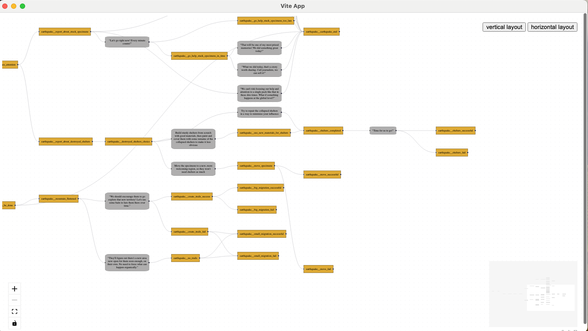

# outplant admin electron poc

A POC of **@xyflow/svelte** running in **electron** with **vite** for our [Outplant \(in development\) game](https://github.com/AcevedoR/outplant). It should launch an electron app and display a beautiful graph like this:


I don't know what half of the confs are doing, there is probably a lot of things to fix and clean, but at least it works..

## Running
you need to manually change your Chain folders at packages/main/src/index.ts:97
```
npm install
npm run watch
```

generated from https://github.com/cawa-93/vite-electron-builder

## TODO
- write mode
  - ~create event~
  - ~create a choice~
  - ~create event from choice~
  - link another choice from event
  - link another event from event
  - ~create an effect from event~
  - ~create an effect from a choice~
  - ~link an effect to event~
  - ~link an effect to choice~
